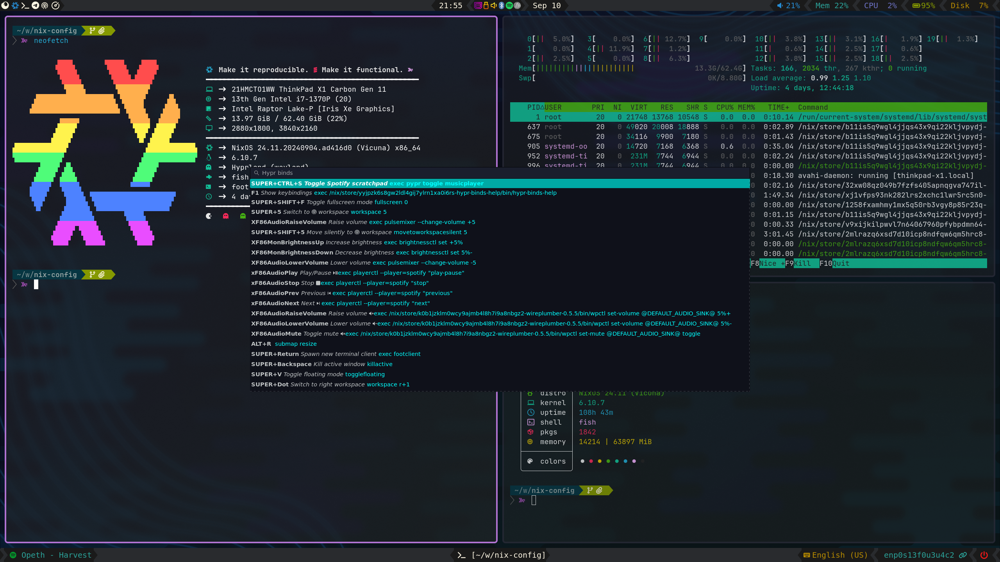

# hypr-binds

[](https://gvolpe.com)
[](https://garnix.io)

Keybinds helper for Hyprland.



## How to use

NOTE: *For now, only Nix flake is supported. Broader support may be considered if there's enough interest*.
 
Try it out before buying:

```console
nix run github:gvolpe/hypr-binds
```

Still here? Add it to your flake inputs:

```nix
{
  hypr-binds-flake = {
    url = github:gvolpe/hypr-binds;
    inputs.nixpkgs.follows = "nixpkgs";
  };
}
```

And add the package to your list of packages:

```
inherit (hypr-binds-flake.${system}) hypr-binds;
```

### Home Manager module

Or make use of the Home Manager module by first adding it to your imports:

```
imports = [
  hypr-binds-flake.homeManagerModules.${system}.default
];
```

And then enabling the program:

```nix
{
  programs.hypr-binds.enable = true;
}
```

It comes with defaults, but it's possible to customize it:

```nix
{
  programs.hypr-binds = {
    enable = true;
    settings = {
      launcher = {
        app = "${lib.getExe pkgs.wofi} --dmenu -m -i -p 'Hypr binds'";
        style = {
          modkey = "<b>$MOD$KEY</b> <i>$DESCRIPTION</i>";
          command = "cyan";
        };
      };
      dispatch = true;
    };
  };
}
```
